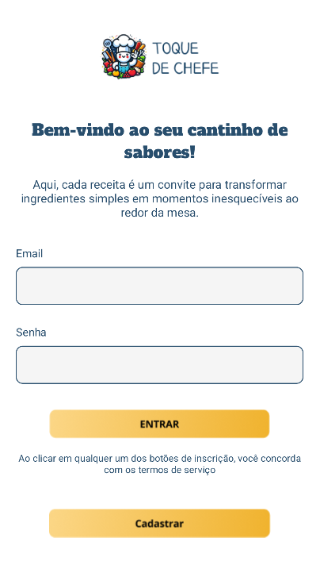

# Projeto Android – Toque do Chef
## 📱 Descrição
Este aplicativo Android foi desenvolvido como parte da avaliação N2 da disciplina de desenvolvimento mobile. O projeto tem tema livre e implementa funcionalidades obrigatórias como o uso de **banco de dados interno** (SQLite/Room) e **consumo de API externa** para tarefas específicas.

## 🎯 Objetivo
Demonstrar as habilidades adquiridas ao longo do curso, como:
- Integração de banco de dados interno no Android.
- Consumo de APIs externas.
- Estruturação de um projeto completo com boas práticas.
- Apresentação funcional na data da N2.

## 🚀 Funcionalidades
- Cadastro e exibição de dados persistentes com banco de dados local.
- Consumo de API externa para complementar informações ou realizar uma tarefa específica.
- Interface intuitiva para facilitar a interação do usuário.
- Estrutura modular seguindo os padrões Android com Kotlin/Java.

## 🛠️ Tecnologias Utilizadas
- Android Studio
- Java
- Room / SQLite
- Retrofit / Volley
- Gradle

## Integrantes do Grupo 👨🏿‍💼 👨🏿‍💼 👩🏻‍💼 👨🏻‍💼

 *Paulo Henrique Rosa* 
 - [@Paulo-back](https://github.com/Paulo-back)
 *Edimário Silva de Paula* 
 - [@DePaulaEd](https://github.com/DePaulaEd)
 *Stefanne Pardim de Arruda Souza* 
 - [@pardimsp](https://github.com/pardimsp)
 *Pablo Borges Rodrigues*
 - [@PabloBorgesRodrigues](https://github.com/PabloBorgesRodrigues)
 
 

## ✅ Requisitos Atendidos
 Uso de banco de dados interno (SQLite/Room)

 Uso de uma API para tarefa específica

 Aplicativo funcionando demonstrado na N2

 ## 📅 Entrega
A apresentação será realizada na data da N2(02/06/2025), demonstrando o app em funcionamento conforme os requisitos da atividade.

## 📽️ Video do app funcionando
- [youtube]()

